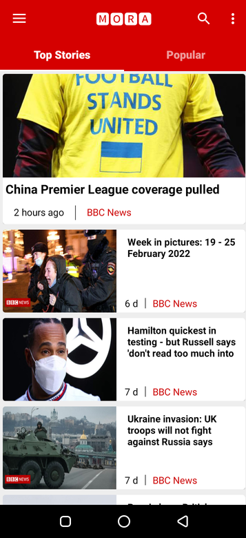
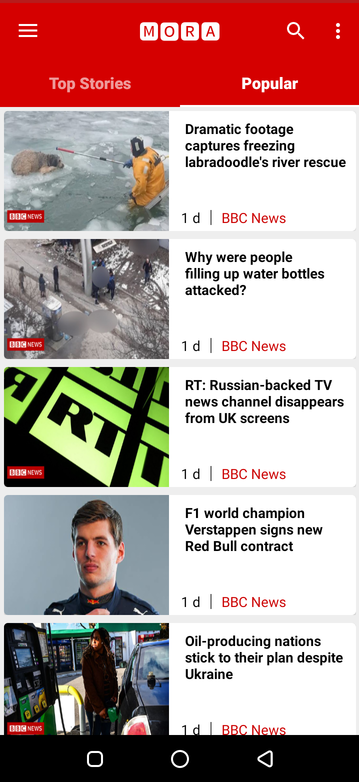
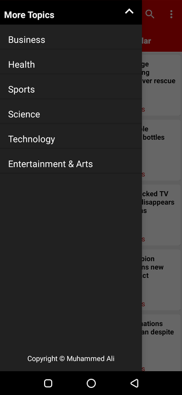
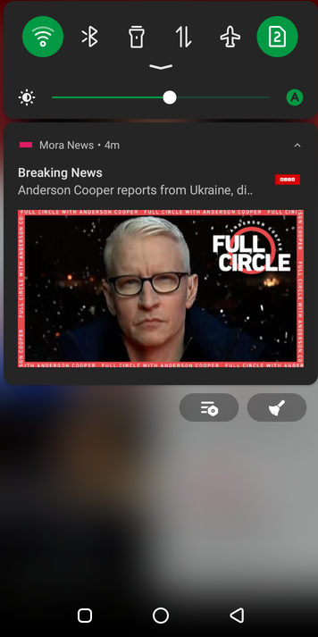
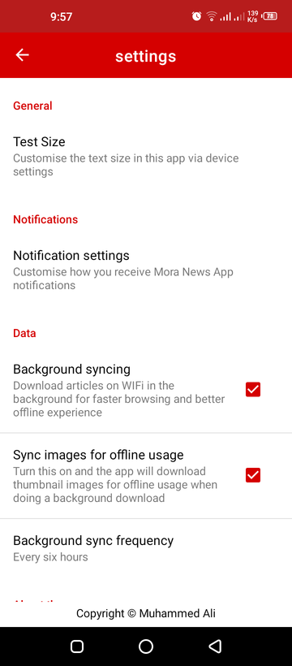

Introduction
------------

Mora News app is the best way to make sure you're able to browse world news.
It provides a lightweight and easy-to-use way to quickly get the news you need.

   
![Mora News, screenshot]screenshot4.png)   
  

Get application demo : 
{Note : the API could stop due to developer version limits of data requesting, the app will act as there is no internet connection}

License
-------
 Copyright 2021 Muhammed Ali Ammar

   Licensed under the Apache License, Version 2.0 (the "License");
   you may not use this file except in compliance with the License.
   You may obtain a copy of the License at

       http://www.apache.org/licenses/LICENSE-2.0

   Unless required by applicable law or agreed to in writing, software
   distributed under the License is distributed on an "AS IS" BASIS,
   WITHOUT WARRANTIES OR CONDITIONS OF ANY KIND, either express or implied.
   See the License for the specific language governing permissions and
   limitations under the License.
